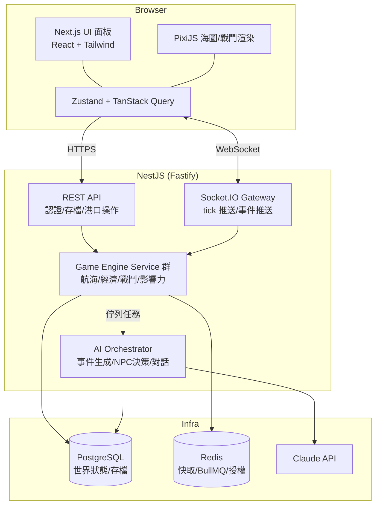

# 00 — 專案總覽與技術選型

## 1. 專案目標

做出一款可在瀏覽器遊玩（Mac / Windows / 平板皆可）的**單人**航海貿易策略遊戲，具備：

1. 開放海圖上的艦隊航行與探索
2. 港口間貿易與動態物價經濟
3. 「商業影響力（Influence Share）」爭奪 —— 本作的勝負核心
4. 回合制海戰
5. 夥伴（航海士）招募與培養
6. 由 AI Agent 驅動的動態事件、NPC 對手與對話，讓每一輪遊戲都不同

**非目標（v1 不做）**：多人同步對戰、手機原生 App、3D 畫面、即時動作戰鬥。
架構上會為未來多人化留伏筆（server-authoritative、所有狀態在後端），但 v1 專注單人體驗。

## 2. 為什麼是這個技術棧

### 2.1 後端：NestJS + Fastify adapter（而非裸 Fastify / Express）

使用者提出 nestjs / fastify / express 三選一。結論：**NestJS，底層掛 Fastify adapter**，理由：

- 這個遊戲後端會有 10+ 個領域模組（航海、貿易、經濟、戰鬥、AI…），NestJS 的 module / DI / 分層約定能讓「另一個 AI 模型接手實作」時有明確的骨架可循，不易寫散。
- NestJS 官方支援 Fastify adapter，能拿到 Fastify 的效能，Express 則兩頭都不佔優。
- 內建整合我們必用的東西：`@nestjs/websockets`（Socket.IO gateway）、`@nestjs/bullmq`（tick 排程與 AI 任務佇列）、`@nestjs/schedule`、class 級 Guard/Interceptor（驗證、速率限制）。
- 測試約定完整（`@nestjs/testing`），對 AI 實作者友善。

### 2.2 資料庫：PostgreSQL + Prisma；Redis 輔助

- 遊戲存檔是高度關聯的資料（玩家→艦隊→船→貨艙→商品；港口→市場→價格歷史），關聯式資料庫是自然選擇。PostgreSQL 的 `JSONB` 又能吃下彈性資料（AI 生成的事件 payload、船隻改裝明細）。
- Prisma：schema 即文件、type-safe client、migration 工具成熟，對 AI 實作者最不容易出錯。
- Redis 三用途：(a) BullMQ 佇列（世界 tick、AI 生成任務）(b) 熱資料快取（市場價格表）(c) Socket.IO adapter（未來水平擴展用）。

### 2.3 前端：Next.js 15 App Router + PixiJS

- Next.js 負責殼（認證、大廳、存檔管理、設定頁 → RSC / SSR），**遊戲本體是一個 client component 掛 PixiJS canvas**（海圖、船隻、戰鬥棋盤都是 2D 精靈，WebGL 渲染，60fps 無壓力）。
- UI 面板（港口選單、交易介面、艦隊管理）用一般 React + Tailwind 疊在 canvas 上層，開發效率遠高於全部畫進 canvas。
- 狀態管理：伺服器狀態用 TanStack Query（REST）+ Socket.IO 事件寫入 Zustand store；本地 UI 狀態用 Zustand。

### 2.4 AI 層：Claude API + 嚴格防護欄

AI 不是遊戲引擎，是「內容與個性的生成器」。原則：

- **規則引擎負責公平與數值**（價格、戰鬥、判定都是確定性純函式），**AI 負責敘事與決策風格**（事件文本、NPC 商會的策略傾向、對話）。
- AI 輸出一律是結構化 JSON（tool use / JSON schema），經 Zod 驗證 + 數值夾限（clamp）後才落地；失敗自動 fallback 到規則引擎的預設內容。
- 非同步生成：AI 呼叫全部走 BullMQ 佇列，不阻塞遊戲 tick。

## 3. 遊戲運行模型（最重要的架構決策）

**Server-authoritative、tick 驅動、單人分世界。**

- 每個「存檔（GameWorld）」是一個獨立的世界實例，屬於一個玩家。
- 世界時間以 **tick** 前進：1 tick = 遊戲內 1 天。玩家在海上航行時，前端以固定節奏（預設 1.5 秒/tick，可加速）向後端請求推進；玩家在港口內時，時間暫停（打開選單、交易不耗時間，出港才走時間）—— 這重現了經典航海遊戲「港內從容、海上緊張」的節奏，也大幅簡化了同步問題。
- 所有規則計算在後端完成，前端只做呈現與輸入。這讓存檔天然防作弊，也讓未來多人化不用重寫。

## 4. 名詞表（全文件統一用語）

| 名詞 | 英文/代碼 | 定義 |
|------|-----------|------|
| 世界 | `GameWorld` | 一個存檔＝一個世界實例 |
| tick | `tick` | 遊戲內一天；世界狀態推進的最小單位 |
| 提督 | `Player` | 玩家角色 |
| 商會 | `Guild` | 玩家或 NPC 經營的商業勢力（NPC 商會由 AI 個性驅動） |
| 艦隊 | `Fleet` | 1~5 艘船組成的移動單位 |
| 航海士 | `Officer` | 可招募的夥伴，有技能與職位 |
| 港口 | `Port` | 海圖節點；有市場、造船廠、酒館等設施 |
| 海域 | `SeaRegion` | 港口的分組（例：北環海、珊瑚環礁群…原創地名） |
| 影響力 | `Influence` | 各商會在單一港口的商業佔有率（0–100，總和 ≤ 100） |
| 交易品 | `Commodity` | 貿易商品，分類（糧食/織品/礦石/奢侈品/工藝品/香料 等原創分類） |
| 發現物 | `Discovery` | 探索可獲得的地理/生物/遺跡發現 |
| 事件 | `WorldEvent` | 世界層級事件（風暴、行情波動、AI 生成劇情事件） |

## 5. 頂層架構圖

## 6. 版權安全準則（實作時必守）

1. 不使用任何既有遊戲的專有名詞（遊戲名、角色名、艦隊名、劇情文本）。
2. 世界地圖為**架空世界**（不是地球），地名全部原創（見 01 的世界觀章節）。
3. 美術素材：v1 用自製簡約向量風 / 生成式素材，不得抓取既有遊戲圖檔。
4. 音樂音效：使用自製或 CC0 素材。
5. 玩法機制（貿易、佔有率、回合海戰）屬於 idea 層面，可以借鑑；具體表達（文字、圖像、數值表的直接複製）不可以。
