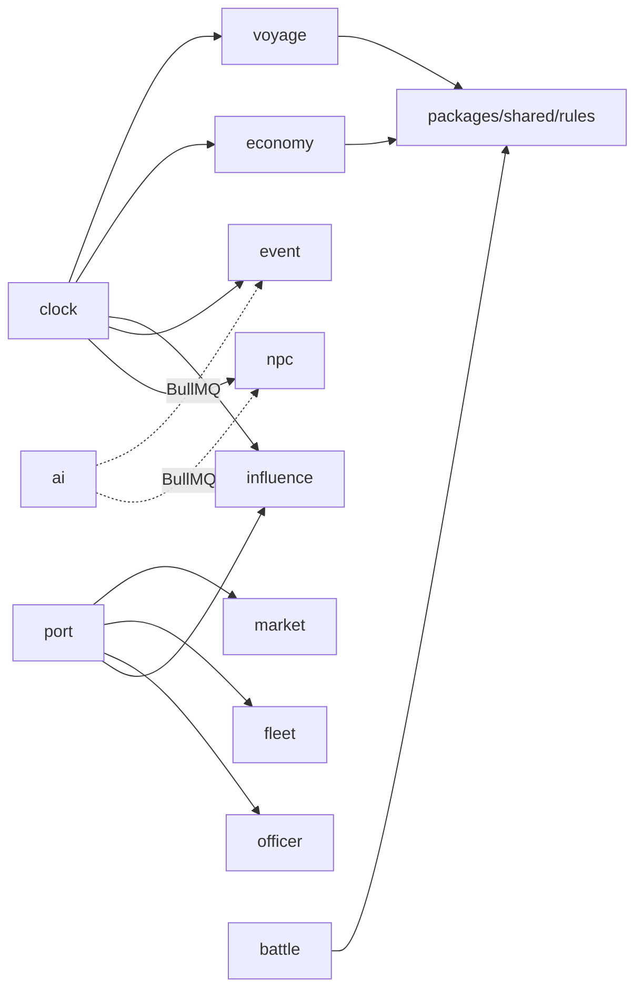

# 02 — 系統架構

## 1. 整體拓撲

```
[Browser SPA]  ⇄ HTTPS (REST)  ⇄ ┐
[Browser SPA]  ⇄ WSS (Socket.IO) ⇄ ┤ NestJS(Fastify) app ─ Prisma ─ PostgreSQL
                                    │        │
                                    │        ├─ ioredis ── Redis（快取/pub-sub）
                                    │        └─ BullMQ ─── Redis（佇列）
                                    │                        │
                                    │            [Worker process(可同進程起步)]
                                    │                 ├─ world-tick processor
                                    │                 └─ ai-generation processor ⇄ Claude API
```

v1 部署形態：**單一 NestJS 進程**同時跑 HTTP + WS + BullMQ worker（`apps/api` 一個進程即可跑起來，開發體驗最好）。程式碼上 worker processor 放在獨立 module，未來要拆進程時只需改啟動入口，不改業務碼。

## 2. 後端模組切分（NestJS Modules）

```
apps/api/src/
├── main.ts                     # Fastify adapter 啟動
├── app.module.ts
├── common/                     # 全域 guard/interceptor/filter/decorators
│   ├── auth/                   # JWT guard、@CurrentPlayer() decorator
│   ├── zod/                    # ZodValidationPipe（所有 DTO 用 shared 的 zod schema）
│   └── errors/                 # GameError 體系（見 §5）
├── modules/
│   ├── auth/                   # 註冊/登入/refresh（v1: email+密碼即可）
│   ├── world/                  # GameWorld 生命週期：建立/讀取/列表/刪除存檔
│   ├── clock/                  # ★ tick 推進協調者（見 05）
│   ├── voyage/                 # 航線設定、艦隊移動、航行事件觸發
│   ├── port/                   # 港內行動總入口（進港/出港/設施）
│   ├── market/                 # 交易撮合、價格查詢
│   ├── economy/                # 每 tick 價格演算、庫存回歸（worker 呼叫）
│   ├── influence/              # 影響力結算、投資、海域霸權判定
│   ├── fleet/                  # 艦隊/船隻 CRUD、編成、造船、改裝
│   ├── officer/                # 航海士招募/指派/成長
│   ├── battle/                 # 海戰 session：建立/行動/解算
│   ├── discovery/              # 探索檢定、發現物、學會登錄
│   ├── event/                  # WorldEvent 管線：排程/觸發/生效/過期
│   ├── npc/                    # NPC 商會回合（策略執行器，AI 只給策略）
│   └── ai/                     # AI Orchestrator（見 06）：佇列、prompt、驗證、fallback
├── gateway/
│   └── game.gateway.ts         # Socket.IO：房間=worldId，推送 tick 結果與事件
└── workers/
    ├── world-tick.processor.ts # BullMQ: 消費 tick 任務 → 呼叫各領域 service
    └── ai-gen.processor.ts     # BullMQ: 消費 AI 生成任務
```

**依賴方向鐵律**：`clock` 只編排、不含規則；領域模組（voyage/economy/…）不互相 import service，需要跨域協作時發 **domain event**（NestJS `EventEmitter2`）或由 `clock` 編排。純計算全部下沉到 `packages/shared/src/rules/`。



## 3. 請求/推送分工（重要約定）

| 互動 | 通道 | 理由 |
|------|------|------|
| 認證、存檔管理 | REST | 標準 CRUD |
| 港內所有操作（交易/造船/招募/投資） | REST | 時間暫停中，請求-回應語意，需要明確成功/失敗 |
| 設定航線、下錨、探索指令 | REST | 寫入意圖，回應驗證結果 |
| tick 推進請求 | WS `client:advance` | 高頻小訊息 |
| tick 結果（位置/消耗/事件/價格摘要） | WS `server:tick` | 伺服器主動廣播 |
| 航行事件、戰鬥邀請、AI 事件上演 | WS `server:event` | 伺服器主動 |
| 海戰內的每一步行動 | WS `battle:*` | 低延遲回合互動 |
| AI 對話（酒館/航海士） | REST（SSE 串流回覆） | 生成較慢，串流體驗好 |

前端斷線重連：WS 重連後發 `client:resync { worldId, lastTick }`，後端回完整快照。**所有 WS 推送都帶 `tick` 序號**，前端丟棄過期訊息。

## 4. tick 推進的併發控制

- 一個世界同一時刻只能有一個 tick 在計算：BullMQ job id = `world:{id}:tick:{n}`（天然去重）+ Redis 鎖 `lock:world:{id}`。
- 玩家的 REST 港內操作與 tick 不會併發（港內時間暫停、海上時 REST 僅允許改航線類輕操作，改航線也走鎖）。
- 世界狀態寫入使用 Prisma transaction；tick 內「讀取快照 → 純函式計算 → 一次性寫回」的模式（見 05 §2）。

## 5. 錯誤處理與回應格式

- REST 統一回應：成功 `{ ok: true, data }`；失敗 `{ ok: false, error: { code, message, details? } }`。
- `GameError` 子類 + 錯誤碼字典放 `packages/shared/src/errors.ts`（前後端共用），例：`INSUFFICIENT_GOLD`、`CARGO_FULL`、`PORT_NOT_DOCKED`、`WORLD_BUSY`（tick 進行中）、`AI_UNAVAILABLE`。
- 所有錯誤碼有對應繁中文案（i18n 表），前端不自行編錯誤訊息。

## 6. 安全與帳號

- 認證：email + 密碼（argon2 雜湊），JWT access(15m)/refresh(30d)；v1 單人遊戲不需要 OAuth，但 auth module 留 provider 介面。
- 授權：所有 world 資源檢查 `world.playerId === jwt.sub`（一個 Guard 統一做）。
- 速率限制：`@fastify/rate-limit`；AI 相關端點另設更嚴格的每玩家配額（保護 API 費用，見 06 §7）。
- 輸入驗證：一律 Zod（shared schema），包含 WS payload。

## 7. 可觀測性

- 結構化日誌 pino（Fastify 原生）；每個 tick 記 `{worldId, tick, durationMs, eventsFired}`。
- 指標：tick 時長 p95、AI 任務成功率/fallback 率、佇列深度。v1 先 log-based，預留 OpenTelemetry hook。

## 8. 部署（v1 從簡）

- `docker-compose.yml`：`web`（Next.js）、`api`（NestJS）、`postgres`、`redis` 四容器，一鍵起。
- 雲上建議：Vercel（web）+ Fly.io / Railway（api + pg + redis）。因為有 WS 與長駐 worker，**api 不能上 serverless**。
- 環境變數清單（`.env.example` 必須維護）：`DATABASE_URL`、`REDIS_URL`、`JWT_SECRET`、`ANTHROPIC_API_KEY`、`AI_ENABLED`（=false 時全域走 fallback，開發免 API key 也能玩）。
